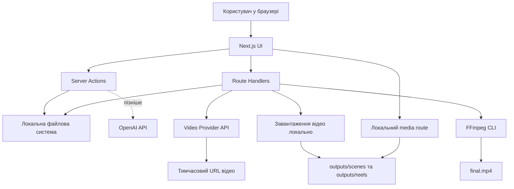
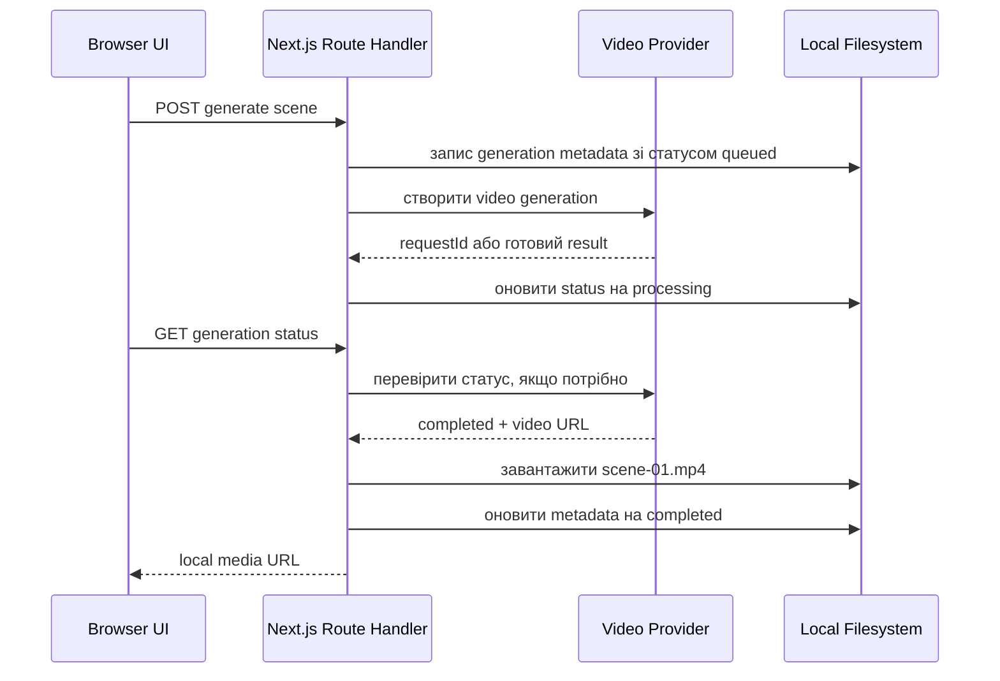

# Архітектура

## Ціль

Побудувати дуже маленький локальний застосунок для генерації вертикальних AI Reels на основі сюжету, який користувач вставляє вручну, ручного блоку сцен, персонажів і reference assets.

Головні принципи:

- мінімум коду;
- мінімум залежностей;
- без бази даних;
- без окремого backend;
- без Docker;
- без auth;
- без черг, Redis, ORM і cloud storage;
- усе працює тільки на `localhost`.

## Високорівнева схема



## Основні модулі

### UI

Next.js App Router сторінки:

- `/` або `/project` для налаштувань проєкту;
- `/characters` для персонажів;
- `/reels/new` для ручного введення сюжету;
- `/reels/[reelId]` для редактора Reel;
- `/outputs` або секція у редакторі для перегляду фінального MP4.

UI має бути простим: форми, списки, картки і превʼю відео. Не потрібні складні дизайн-системи, глобальні state managers або UI-бібліотеки.

### Server Actions

Server Actions варто використовувати для простих мутацій, які природно привʼязані до форм:

- зберегти налаштування проєкту;
- створити або оновити персонажа;
- зберегти вручну введений сюжет як Reel;
- зберегти ручний блок сцен;
- оновити текст сцени, mentions і references;
- змінити статус або metadata, якщо це коротка синхронна дія.

Причина: менше boilerplate, зручно з App Router, немає потреби створювати API endpoint для кожної простої форми.

### Route Handlers

Route Handlers варто використовувати для операцій, які:

- довго виконуються;
- повертають JSON для polling;
- працюють з файлами;
- завантажують або віддають медіа;
- запускають FFmpeg;
- викликають зовнішні AI API.

Приклади:

- `POST /api/ideas/generate`
- `POST /api/reels/[reelId]/scenes/[sceneId]/generate`
- `GET /api/generations/[generationId]`
- `POST /api/reels/[reelId]/render`
- `GET /api/media/[...path]`

Причина: довгі задачі, polling і media preview краще контролювати через явні HTTP endpoints.

## Локальне зберігання

Дані зберігаються у двох кореневих папках:

- `data/` для JSON і reference assets;
- `outputs/` для згенерованих відео та фінальних MP4.

Жодної бази даних у MVP. Для локального single-user сценарію JSON-файли достатні й зменшують складність.

### Приклад потоку збереження



## Project JSON

Базовий файл:

```text
data/projects/default/project.json
```

Мінімальний формат:

```ts
export type ProjectSettings = {
  id: string;
  appName: string;
  appDescription: string;
  targetAudience: string;
  marketingAngle: string;
  defaultCta: string;
  contentStyle: string;
  createdAt: string;
  updatedAt: string;
};
```

Для MVP достатньо одного локального проєкту `default`. Підтримку кількох проєктів можна додати пізніше без зміни загальної структури.

## Персонажі

Персонажі живуть у:

```text
data/projects/default/characters/
```

Тип:

```ts
export type Character = {
  id: string;
  name: string;
  age?: string;
  description: string;
  appearance: string;
  personality: string;
  clothes?: string;
  referenceImages: string[];
  voiceId?: string;
  createdAt: string;
  updatedAt: string;
};
```

`referenceImages` містить тільки локальні відносні шляхи всередині дозволеної project-папки. Це важливо, щоб пізніше безпечно передавати reference images у compatible image-to-video або reference-to-video моделі.

## Сцени, mentions і references

У першому MVP сцени не генеруються через LLM. Користувач вставляє один текстовий блок із описами всіх сцен у Reel editor.

Рекомендований ручний формат:

```text
Сцена 1:
@Sofia відкриває застосунок на телефоні. На екрані видно #screen-home.
Короткий динамічний кадр, 4 секунди.

Сцена 2:
@Sofia усміхається, поруч зʼявляється #logo як reference для бренду.
```

Домовленості формату:

- `@НазваПерсонажа` означає персонажа з `data/projects/default/characters/`;
- `#назва-референсу` означає додатковий asset/reference, наприклад logo або screenshot застосунку;
- unknown `@mentions` і `#references` показуються як warnings, але не блокують збереження;
- `rawText` сцени залишається головним джерелом правди;
- `videoPrompt` у V1 може дорівнювати `rawText`.

Очікуваний тип:

```ts
export type ReelScene = {
  id: string;
  order: number;
  rawText: string;
  durationSeconds?: number;
  videoPrompt: string;
  characterNames: string[];
  characterIds: string[];
  referenceNames: string[];
  referencePaths: string[];
  status: "draft" | "queued" | "processing" | "completed" | "failed";
  outputPath?: string;
};
```

`scenes.json` має також зберігати `sourceText`, щоб користувач міг повернутися до оригінального pasted тексту без втрати форматування.

## LLM-виклики

У першому MVP LLM **не генерує сюжет з нуля**. Користувач сам вставляє сюжет, рекламну ідею, чорновий сценарій і блок сцен.

У V1 LLM-виклики не є обовʼязковими. Їх краще додати після ручного end-to-end flow.

Пізніше можна додати:

- `splitUserStoryIntoScenes`: розбиває вручну введений сюжет на сцени;
- `generateVideoPrompts`: готує prompts для video provider.
- `generateReelIdeas`: створює ідеї для коротких відео;
- `generateScript`: створює hook, сюжет, короткий сценарій і CTA.

Промпти варто зберігати у:

```text
lib/ai/prompts/
```

Очікувані JSON-типи:

```ts
export type UserStoryInput = {
  title: string;
  story: string;
  cta?: string;
  style?: string;
};

// Для LLM-фази можна використати ReelScene з секції вище
// і додати dialogue / visualDescription тільки якщо вони реально потрібні UI.
```

LLM відповіді треба парсити як JSON і валідувати мінімально: наявність обовʼязкових полів, очікувані типи, непорожній список сцен.

## Video provider abstraction

У V1 підтримується тільки один provider. Абстракція має бути дуже тонкою:

```ts
export type VideoGenerationInput = {
  prompt: string;
  durationSeconds: number;
  aspectRatio: "9:16";
  characterReferencePaths?: string[];
  assetReferencePaths?: string[];
};

export type VideoGenerationResult = {
  provider: string;
  model: string;
  generationId: string;
  status: "queued" | "processing" | "completed" | "failed";
  temporaryVideoUrl?: string;
  errorMessage?: string;
  estimatedCostUsd?: number;
};

export interface VideoProvider {
  generateVideo(input: VideoGenerationInput): Promise<VideoGenerationResult>;
  getGenerationStatus?(generationId: string): Promise<VideoGenerationResult>;
}
```

Не потрібні factories, dependency injection frameworks або складні domain layers. У V1 можна мати один файл:

```text
lib/ai/video-providers/fal.ts
```

і маленький selector:

```text
lib/ai/video-providers/index.ts
```

## Рекомендований перший video provider

Для першої реалізації рекомендовано **fal.ai**.

Причини:

- зазвичай простіший developer experience для швидких media experiments;
- багато моделей доступні через один API;
- добре підходить для локального MVP;
- простіше стартувати з одним provider і не розпорошувати архітектуру.

Google Veo варто залишити як альтернативу на пізніше, коли базовий flow уже працює.

## Async generation без черг

Для MVP не потрібні Redis, BullMQ або background workers.

Найпростіший підхід:

1. UI надсилає `POST` на генерацію сцени.
2. Server route створює metadata JSON зі статусом `queued`.
3. Server route викликає provider.
4. Якщо provider повертає request id, UI polling-ом викликає `GET /api/generations/[generationId]`.
5. Коли provider повертає ready URL, server route завантажує MP4 локально.
6. Metadata оновлюється на `completed`.
7. UI показує локальне відео через media route.

Якщо SDK provider має простий `subscribe` або `wait` механізм, його можна використати для V1, але все одно зберігати результат локально.

## Локальне media preview

Не варто відкривати `outputs/` напряму як public static folder. Краще зробити контрольований route:

```text
GET /api/media/[...path]
```

Правила:

- приймати тільки відносний шлях;
- нормалізувати шлях через Node `path`;
- перевіряти, що resolved path залишається всередині `outputs/` або дозволеної media-папки;
- віддавати тільки дозволені типи файлів: `.mp4`, `.webm`, `.png`, `.jpg`, `.jpeg`;
- не дозволяти `..`, absolute paths або довільні shell-команди.

## FFmpeg

FFmpeg потрібен для:

- приведення clips до 1080x1920;
- нормалізації fps і codec;
- склеювання сцен;
- експорту H.264 MP4;
- майбутніх overlays: subtitles, CTA, logo, music.

У Node.js краще запускати локально встановлений `ffmpeg` через `child_process.spawn`, а не додавати важку wrapper-бібліотеку.

Команда має будуватися з контрольованих аргументів, без shell string concatenation.

## Базові помилки

Документуємо й обробляємо тільки практичні сценарії:

- немає API key;
- provider request failed;
- generation still processing;
- provider temporary URL expired;
- download failed;
- output folder missing;
- FFmpeg не встановлений або впав;
- invalid AI JSON response;
- media path invalid.

## Безпека для localhost

Auth не потрібна, бо це single-user localhost MVP.

Але потрібні базові правила:

- API keys тільки в `.env.local`;
- жодного доступу до ключів з client components;
- всі AI-виклики тільки server-side;
- шлях до файлів завжди sanitize;
- FFmpeg запускати тільки з контрольованими аргументами;
- не виконувати довільні команди з UI.
